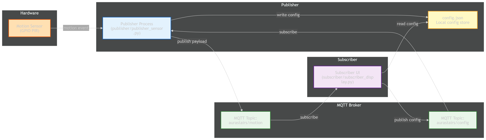
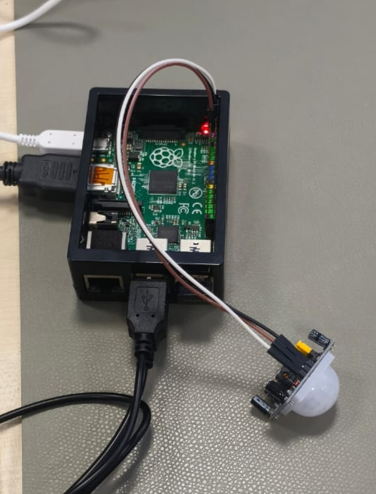

# AuraStairs

AuraStairs is a decentralized MQTT-based motion monitoring system designed to capture sensor data from a Raspberry Pi and display it in a desktop application. The system supports real-time configuration updates, which are published over MQTT and persisted locally.

> Built as part of an edge device case study at Deggendorf Institute of Technology (DIT).

---

## Architecture Overview



---

## Hardware


## Features

- Real-time motion visualization with indicator and time-series graph
- Performance metrics: latency, packet loss, throughput
- Live configuration updates from the UI, broadcast to publisher via MQTT
- Persistent configuration in `config.json`
- Logging for both publisher and subscriber components

## Requirements

- Python 3.9 or later
- MQTT broker (e.g., Mosquitto)
- On Raspberry Pi: GPIO access and PIR motion sensor on GPIO pin 4

## Installation

1. Install Python dependencies:

```bash
python -m pip install -r requirements.txt
```

2. Install system dependencies for the UI:
   - **Ubuntu/Debian:** `sudo apt install python3-tk python3-matplotlib`
   - **macOS:** `python3 -m pip install matplotlib` (Tkinter is included)
   - **Windows:** `python -m pip install matplotlib` (Tkinter is included)

## Configuration

Configuration is stored in `config.json`:

```json
{
  "broker-subscriber": "10.42.0.1",
  "broker-publisher": "10.42.0.1",
  "port": 1883,
  "topic": "aurastairs/motion",
  "config_topic": "aurastairs/config",
  "max_sensor_log": 50,
  "warmup_ignore_s": 5,
  "publish_interval_s": 3
}
```

Configuration parameters:

| Parameter            | Description                                     |
| -------------------- | ----------------------------------------------- |
| `broker-publisher`   | MQTT broker address for publisher               |
| `broker-subscriber`  | MQTT broker address for subscriber              |
| `port`               | MQTT broker port (default: 1883)                |
| `topic`              | Topic for motion data publication               |
| `config_topic`       | Topic for configuration updates                 |
| `max_sensor_log`     | Maximum sensor readings stored in memory        |
| `warmup_ignore_s`    | Seconds to ignore sensor readings after startup |
| `publish_interval_s` | Publisher update interval in seconds            |

## Usage

### Start Publisher

```bash
python publisher/publisher_sensor.py
```

Reads the PIR sensor, packages data as JSON, and publishes to the configured MQTT topic.

### Start Subscriber

```bash
python subscriber/subscriber_display.py
```

Connects to MQTT broker and displays sensor data in a desktop GUI. Configuration can be updated from the UI and is broadcast to the publisher.

---

## Logging

- Publisher: `publisher.log`
- Subscriber: `subscriber.log`
- Configuration updates: `config_updates.log`

## Troubleshooting

| Issue                      | Solution                                                                                                 |
| -------------------------- | -------------------------------------------------------------------------------------------------------- |
| No data in UI              | Verify MQTT broker is running and both publisher/subscriber are configured for the same broker and topic |
| Publisher connection fails | Check `broker-publisher` and `port` in `config.json`                                                     |
| UI fails to start          | Ensure `tkinter` and `matplotlib` are installed                                                          |

## Notes

- The publisher expects a PIR sensor on GPIO pin 4. For non-Raspberry Pi environments, use the mock sensor in `sensor_utils.py`.
- This is an active development project and can be extended with persistent storage, authentication, or advanced analytics.
